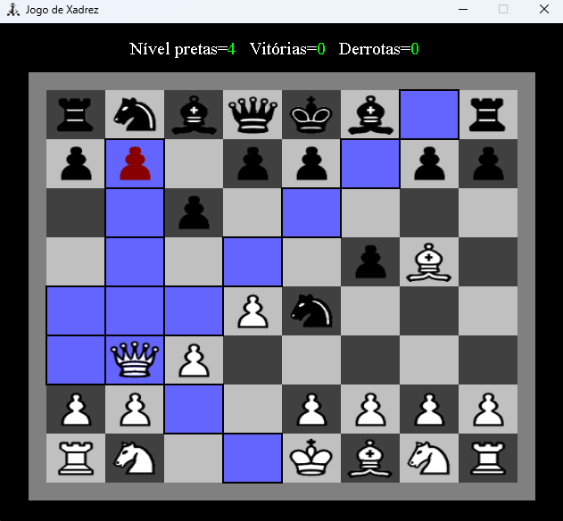

# Italo Xadrez em Java

Para rodar o jogo, basta baixar o arquivo Italo-Xadrez-2.6.2.jar e rodar executando o seguinte comando:

java -jar Italo-Xadrez-2.6.2.jar

Ou, se estiver no windows, pode dar dois cliques no arquivo Italo-Xadrez-2.6.2.jar.

Obs, para funcionar depende do java 1.8 ou superior instalado na máquina

Para mais detalhes, visite a página do projeto em: https://www.italoinfo.com.br/jogos/jogo-de-xadrez-java

|  :zap:  Esta versão do jogo utiliza muita memória. de 300MB à pouco mais de 1GB   |
|-----------------------------------------------------------------------------------|

|  :zap:  Isso acontece porque, em java, o garbage collector (GC) é automático!     |
|-----------------------------------------------------------------------------------|

|  :zap:  A versão em C++ utiliza entre 15MB e 24MB apenas  |
|-----------------------------------------------------------|

Há uma versão do jogo produzida em C++. Acesse em: https://www.italoinfo.com.br/jogos/jogo-de-xadrez
